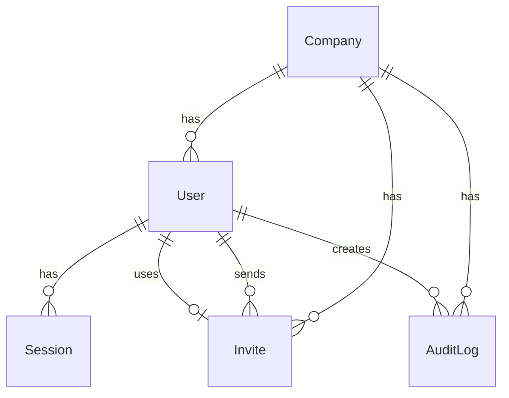

# Schema Documentation - Task T0.003

## Database Structure

### Tables Overview



### 1. **companies**
Stores multi-tenant company information.

| Field | Type | Description |
|-------|------|-------------|
| id | UUID | Primary key |
| name | String | Company name |
| slug | String | URL-friendly identifier (unique) |
| cnpj | String? | Brazilian company document (unique) |
| phone | String? | Contact phone |
| email | String? | Contact email |
| address | Text? | Company address |
| isActive | Boolean | Active status |
| settings | JSON? | Company-specific settings |
| createdAt | DateTime | Creation timestamp |
| updatedAt | DateTime | Last update timestamp |
| deletedAt | DateTime? | Soft delete timestamp (LGPD) |

**Indexes:**
- slug (unique)
- isActive

### 2. **users**
Stores user accounts with role-based access control.

| Field | Type | Description |
|-------|------|-------------|
| id | UUID | Primary key |
| email | String | User email (unique) |
| password | String | Bcrypt hashed password |
| name | String | User full name |
| phone | String? | Contact phone |
| avatar | String? | Avatar URL |
| role | Role | User role (enum) |
| isActive | Boolean | Active status |
| isEmailVerified | Boolean | Email verification status |
| lastLoginAt | DateTime? | Last login timestamp |
| companyId | String | Foreign key to Company |
| createdAt | DateTime | Creation timestamp |
| updatedAt | DateTime | Last update timestamp |
| deletedAt | DateTime? | Soft delete timestamp (LGPD) |

**Indexes:**
- email (unique)
- companyId
- role
- isActive

### 3. **invites**
Manages invitation tokens for new user registration.

| Field | Type | Description |
|-------|------|-------------|
| id | UUID | Primary key |
| token | String | Unique invitation token |
| email | String | Invitee email |
| role | Role | Assigned role |
| companyId | String | Foreign key to Company |
| invitedById | String | Foreign key to User (sender) |
| usedById | String? | Foreign key to User (recipient) |
| expiresAt | DateTime | Token expiration |
| usedAt | DateTime? | Usage timestamp |
| createdAt | DateTime | Creation timestamp |
| updatedAt | DateTime | Last update timestamp |

**Indexes:**
- token (unique)
- email
- companyId
- expiresAt

### 4. **sessions**
Manages JWT refresh tokens and user sessions.

| Field | Type | Description |
|-------|------|-------------|
| id | UUID | Primary key |
| userId | String | Foreign key to User |
| refreshToken | Text | JWT refresh token (unique) |
| userAgent | Text? | Browser user agent |
| ipAddress | String? | Client IP address |
| isValid | Boolean | Session validity |
| expiresAt | DateTime | Session expiration |
| createdAt | DateTime | Creation timestamp |
| updatedAt | DateTime | Last update timestamp |

**Indexes:**
- userId
- refreshToken (partial)
- expiresAt

### 5. **audit_logs**
Records system activities for LGPD compliance.

| Field | Type | Description |
|-------|------|-------------|
| id | UUID | Primary key |
| action | String | Action type (LOGIN, LOGOUT, CREATE, etc.) |
| entityType | String | Entity type (User, Company, etc.) |
| entityId | String? | Entity identifier |
| userId | String? | Foreign key to User |
| companyId | String? | Foreign key to Company |
| metadata | JSON? | Additional context |
| ipAddress | String? | Client IP address |
| userAgent | Text? | Browser user agent |
| createdAt | DateTime | Creation timestamp |

**Indexes:**
- action
- entityType
- userId
- companyId
- createdAt

## Enums

### Role
User role enumeration for RBAC.

| Value | Description |
|-------|-------------|
| MASTER_ADMIN | System-wide administrator (BR SISTEMAS) |
| ADMIN | Company administrator |
| OPERADOR | Support operator/agent |
| CLIENTE | End client/customer |

## Relationships

### One-to-Many
- Company → Users
- Company → Invites
- Company → AuditLogs
- User → Sessions
- User → Invites (sent)
- User → AuditLogs

### One-to-One
- User ← Invite (used by)

## LGPD Compliance Features

1. **Soft Delete**: `deletedAt` fields on Company and User tables
2. **Audit Trail**: All actions logged in audit_logs table
3. **Data Encryption**: Password fields use bcrypt hashing
4. **PII Fields**: Marked for encryption in production (cnpj, phone, address)
5. **Data Retention**: Configurable via RETENTION_DAYS environment variable

## Seed Data Summary

### Companies
- **BR SISTEMAS**: Master company
- **TechCorp Soluções**: Test company

### Users (7 total)
- 1 Master Admin (BR SISTEMAS)
- 1 Admin (TechCorp)
- 2 Operators (TechCorp)
- 2 Clients (TechCorp)

### Test Credentials

| Role | Email | Password |
|------|-------|----------|
| Master Admin | admin@brsistemas.com.br | Master@Admin2025 |
| Company Admin | admin@techcorp.com.br | Sysdesk@2025 |
| Operator | maria.santos@techcorp.com.br | Sysdesk@2025 |
| Client | ana.costa@cliente.com.br | Sysdesk@2025 |

### Invites (3 total)
- 2 Active invites (operator and client)
- 1 Expired invite (for testing)

### Audit Logs
- Login events
- Company creation
- User creation

## Migration Commands

```bash
# Generate Prisma Client
pnpm db:generate

# Create and apply migrations
pnpm db:migrate

# Reset database and apply migrations
pnpm db:migrate:reset

# Run seed
pnpm db:seed

# Open Prisma Studio
pnpm db:studio
```
